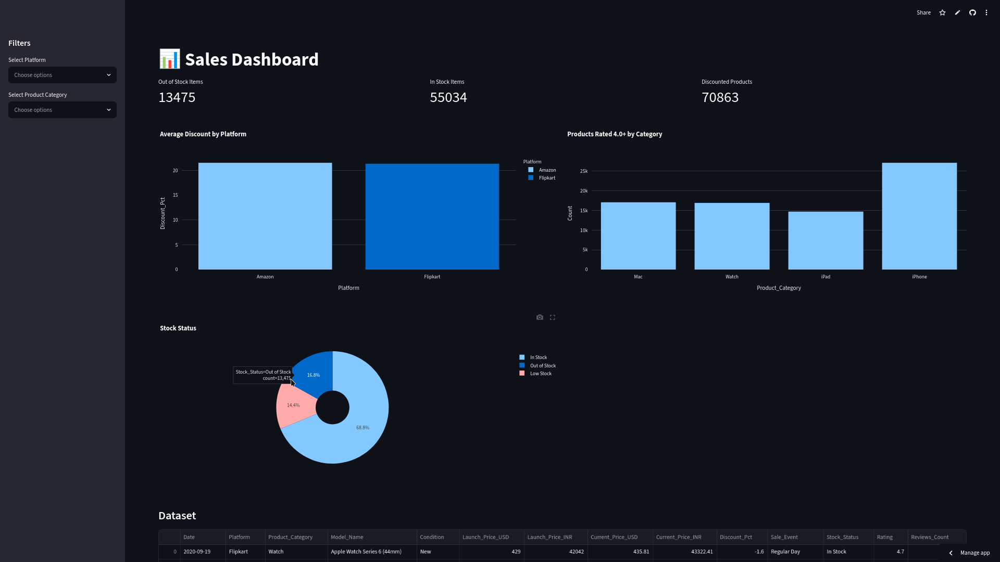

# 📱 Apple Products Pricing Dashboard

An interactive analytics dashboard built with **Streamlit**, **Pandas**, and **Plotly** for exploring Apple product pricing, discounts, inventory, and customer ratings across multiple sales platforms.

The dashboard enables users to analyze pricing trends, compare product categories, monitor stock availability, and explore discount strategies through interactive visualizations.

---

## 🚀 Live Demo

👉 https://icuwtqxtuqxfgkw7reqczl.streamlit.app/

---

# 📸 Dashboard Preview



---

# ✨ Features

- Interactive dashboard built with Streamlit
- Filter by Platform
- Filter by Product Category
- Real-time KPI metrics
- Interactive Plotly charts
- Inventory monitoring
- Discount analysis
- Customer rating insights
- Responsive dashboard layout

---

# 📊 Dashboard Metrics

The dashboard provides key business metrics including:

- Out of Stock Items
- In Stock Items
- Discounted Products

---

# 📈 Visualizations

### Average Discount by Platform

Compare average discounts across different online marketplaces.

### Products Rated 4.0+ by Category

Identify which product categories receive the highest number of highly rated products.

### Stock Status Distribution

Analyze inventory availability using a donut chart.

---

# 📋 Dataset

Dataset:

```
cleaned_apple_products.csv
```

The dataset contains information such as:

- Platform
- Product Category
- Product Name
- Launch Price
- Current Price
- Discount Percentage
- Customer Rating
- Review Count
- Stock Status
- Availability
- Product Condition

---

# 🛠 Tech Stack

- Python
- Streamlit
- Pandas
- Plotly Express

---

# 📦 Installation

Clone the repository

```bash
git clone https://github.com/yourusername/apple-products-dashboard.git
```

Navigate into the project

```bash
cd apple-products-dashboard
```

Install dependencies

```bash
pip install -r requirements.txt
```

Run the application

```bash
streamlit run app.py
```

---

# 📁 Project Structure

```
apple-products-dashboard/
│
├── app.py
├── cleaned_apple_products.csv
├── requirements.txt
├── README.md
└── images/
    └── dashboard.png
```

---

# 🎯 What I Practiced

This project helped me improve my skills in:

- Data cleaning with Pandas
- Interactive dashboard development
- KPI calculation
- Business data visualization
- Plotly chart customization
- Streamlit filtering
- Dashboard deployment using Streamlit Community Cloud

---

# 💼 Business Insights

Using this dashboard, users can quickly answer questions such as:

- Which platform offers the highest average discounts?
- Which Apple product category receives the most positive ratings?
- What percentage of products are currently in stock?
- How many products are discounted?
- How does inventory vary across categories?

---

# 🔮 Future Improvements

- Price trend analysis over time
- Product search functionality
- CSV export for filtered data
- Additional filters
- Sales forecasting
- Interactive comparison page
- Mobile UI improvements

---

# 👨‍💻 Author

**Metin**

GitHub: https://github.com/metinntrn
